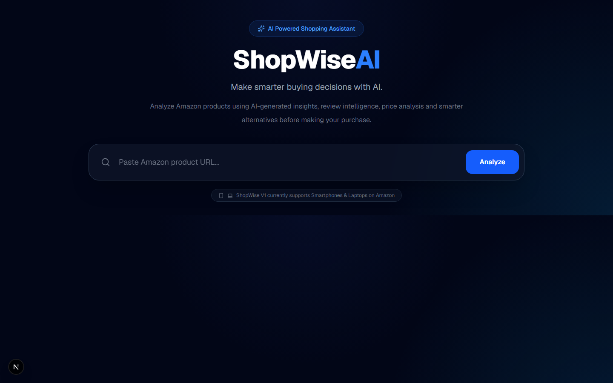
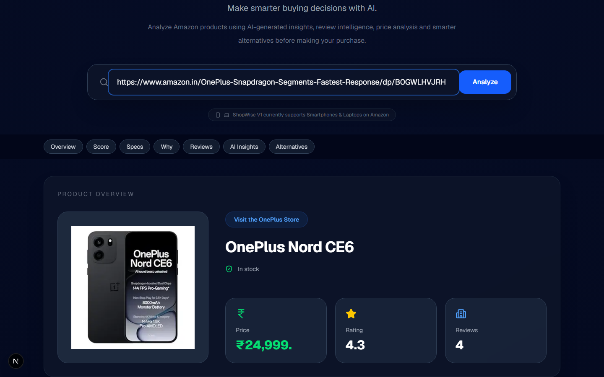
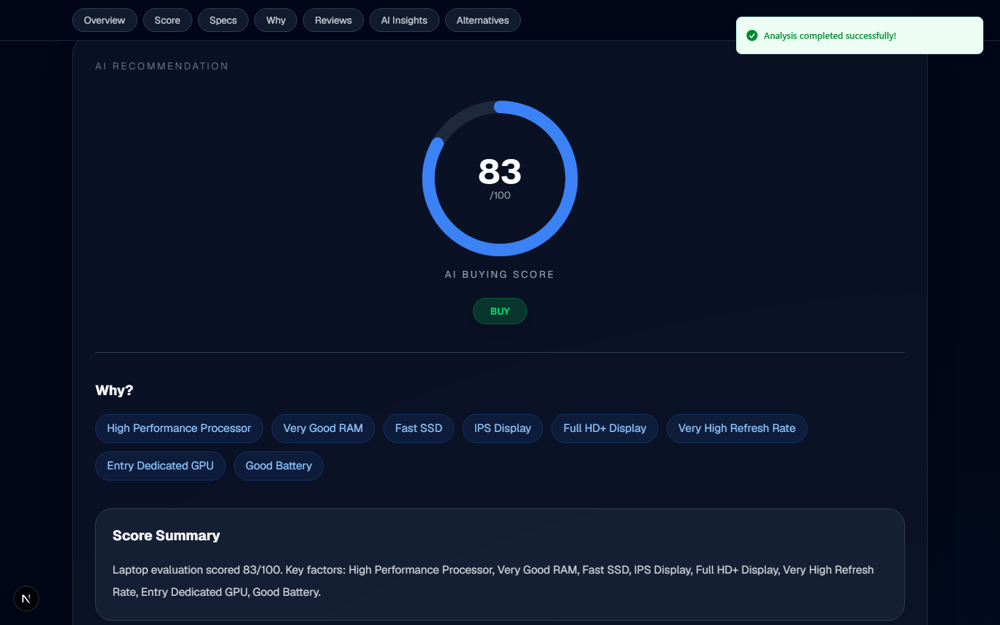
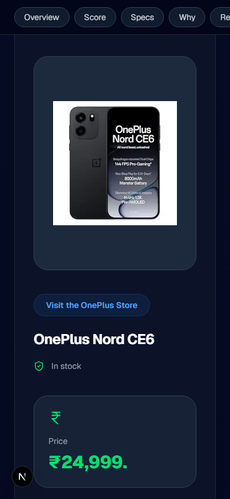
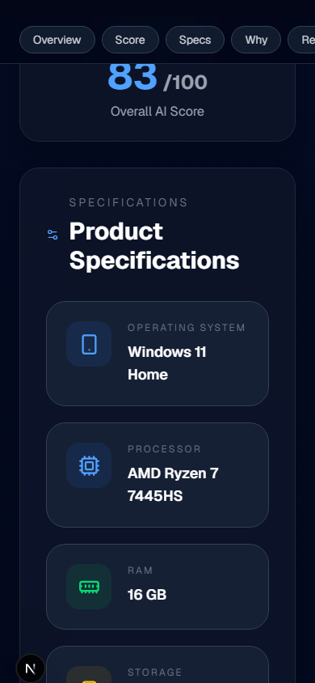

<div align="center">

# 🛒 ShopWise AI

### 🚀 AI-Powered Product Analysis & Buying Decision Assistant

**Next.js • TypeScript • FastAPI • Python • Gemini • RAG**

[](https://nextjs.org/)
[](https://www.typescriptlang.org/)
[](https://react.dev/)
[](https://fastapi.tiangolo.com/)
[](https://www.python.org/)
[](https://ai.google.dev/)
[](https://www.trychroma.com/)
[](https://tailwindcss.com/)

<br>

[](https://shop-wise-ai-cyan.vercel.app/)
[](https://github.com/chintasankarraj/ShopWise-AI)

</div>

---
## 🛒 About ShopWise AI

ShopWise AI is a full-stack AI-powered shopping assistant that analyzes **Amazon smartphones and laptops** using real product data, rule-based scoring, customer reviews, Retrieval-Augmented Generation (RAG), and Google Gemini.

Paste an Amazon product URL and get a **transparent recommendation score, BUY / CONSIDER / AVOID verdict, AI-generated insights, review analysis, and verified alternative products** — all in one dashboard.

---

## 🚀 Live Demo

🔗 **Live Application:**  
https://shop-wise-ai-cyan.vercel.app/

ShopWise AI V1 is publicly deployed and currently supports **Amazon smartphones and laptops**.

---

## 📸 Screenshots

### 🏠 Landing Page



---

### 📱 Smartphone Analysis



---

### 💻 Laptop Analysis



---

### 📱 Mobile Smartphone Results



---

### 💻 Mobile Laptop Results



---

## ✨ Features

- 🛒 Analyze real Amazon product listings
- 📱 Smartphone analysis
- 💻 Laptop analysis
- 🔍 Automatic product category detection
- 📊 Transparent 0–100 recommendation score
- 🎯 BUY / CONSIDER / AVOID verdict
- 🧠 Explainable rule-based scoring engine
- 🤖 AI-generated product summary using Google Gemini
- 👍 AI-generated pros and cons
- 💬 Real customer review analysis
- 😊 Review sentiment analysis
- 🔎 Verified alternative product discovery
- 🌐 Google Search grounded alternatives
- 🛡️ Product verification before displaying alternatives
- 🧠 RAG-powered product knowledge
- 📚 ChromaDB vector database
- ⚡ Deterministic fallback when AI services fail
- 📈 Detailed product specifications
- 📱 Responsive desktop and mobile UI
- ✨ Modern animated dashboard
- 🔔 Toast notifications
- ⏳ Real-time loading states
- 🛡️ Honest handling of missing or unavailable data

---

## 🎯 The Problem

Online shopping platforms contain a huge amount of product information, but important buying signals are often difficult to evaluate.

A buyer may need to:

- Read through long product descriptions
- Compare processor and hardware specifications
- Analyze customer reviews manually
- Identify common complaints
- Compare competing products
- Determine whether the price is justified
- Verify whether alternative products are actually available

ShopWise AI brings these steps together into a **single automated product-analysis workflow**.

---

## 💡 How ShopWise AI Works

Simply paste an Amazon smartphone or laptop URL.

The application then:

1. 🔍 Extracts the product information
2. 🏷️ Detects the product category
3. 📊 Calculates a deterministic recommendation score
4. 🔎 Searches for alternative products
5. 🛡️ Verifies alternative products against real Amazon listings
6. 🤖 Generates AI-powered insights
7. 💬 Analyzes available customer reviews
8. 📦 Returns everything through a unified API response
9. 🖥️ Displays the results in the Next.js dashboard

---

## 🧠 Recommendation System

The recommendation score is **not generated by AI**.

ShopWise uses a deterministic, explainable scoring engine so that the same product specifications always produce the same result.

### 📱 Smartphone Scoring

| Category | Weight |
|---|---:|
| Performance | 25 |
| Display | 20 |
| Battery | 15 |
| Camera | 10 |
| RAM + Storage | 10 |
| Charging | 10 |
| Durability | 5 |
| Connectivity | 5 |
| **Total** | **100** |

### 💻 Laptop Scoring

| Category | Weight |
|---|---:|
| Processor | 30 |
| RAM | 20 |
| Display | 18 |
| GPU | Up to 12 |
| Storage | 15 |
| Battery | 10 |

---

## 🎯 Recommendation Verdict

| Score | Verdict |
|---:|---|
| ⭐ 80–100 | **BUY** |
| 🟡 60–79 | **CONSIDER** |
| 🔴 Below 60 | **AVOID** |

Every scoring decision is accompanied by human-readable reasons such as:

- High Performance Processor
- Good Battery
- Excellent Display
- Sufficient RAM
- Large Storage

Missing information does not get randomly guessed.

If structured Amazon specifications are unavailable, ShopWise attempts to extract useful information from the product title. If reliable information still cannot be found, that scoring dimension contributes nothing.

---

## 🤖 AI / LLM

ShopWise AI uses **Google Gemini** for the generative AI components of the application.

### AI-powered features

- 🧠 Executive product summaries
- 👍 Pros and cons generation
- 💬 Customer review sentiment analysis
- 🔎 Alternative product discovery
- 📚 RAG-based contextual information

### What is NOT AI-generated?

The recommendation score and final BUY / CONSIDER / AVOID classification are **completely deterministic**.

This separation makes the recommendation system:

- Explainable
- Reproducible
- Consistent
- Independent of AI availability

---

## 🧠 Retrieval-Augmented Generation

ShopWise AI uses a lightweight **RAG pipeline** powered by:

- Google Gemini embeddings
- ChromaDB
- Product knowledge documents
- Retrieved contextual information

The retrieved information is combined with product data and available customer reviews before generating AI insights.

This helps provide more grounded product explanations rather than relying only on the model's general knowledge.

---

## 💬 Customer Review Intelligence

ShopWise analyzes available real customer review text rather than relying only on star ratings.

The system extracts:

- 😊 Sentiment
- 👍 Common positive aspects
- 👎 Common complaints
- 💬 Review-based insights

If a product has very few reviews, ShopWise clearly communicates the limitation instead of generating unsupported conclusions.

---

## 🔎 Verified Alternatives

ShopWise can discover alternative products using:

**Google Gemini + Google Search**

If that process fails, the application attempts a:

**DuckDuckGo search fallback**

However, alternatives are **never displayed simply because an AI model suggested them**.

Each candidate is independently checked against a real Amazon listing before being displayed.

This prevents the application from presenting unverified products as available alternatives.

---

## 🏗️ System Architecture

```text
                    Amazon Product URL
                            │
                            ▼
                 ┌─────────────────────┐
                 │  Product Extraction │
                 │ BeautifulSoup/lxml  │
                 │     ScraperAPI      │
                 └──────────┬──────────┘
                            │
                            ▼
                 ┌─────────────────────┐
                 │ Category Detection  │
                 │ Smartphone / Laptop │
                 └──────────┬──────────┘
                            │
                            ▼
                 ┌─────────────────────┐
                 │ Recommendation      │
                 │ Scoring Engine       │
                 │ Rule-Based / 0-100  │
                 └──────────┬──────────┘
                            │
                  ┌─────────┴─────────┐
                  │                   │
                  ▼                   ▼
        ┌─────────────────┐   ┌──────────────────┐
        │ Alternative     │   │ AI Insights      │
        │ Discovery       │   │ Gemini + RAG      │
        │ Search + Verify │   │ + Reviews         │
        └────────┬────────┘   └────────┬─────────┘
                 │                     │
                 └──────────┬──────────┘
                            ▼
                  ┌─────────────────────┐
                  │ Unified JSON API    │
                  │      Response       │
                  └──────────┬──────────┘
                             │
                             ▼
                  ┌─────────────────────┐
                  │    Next.js UI       │
                  │ Results Dashboard   │
                  └─────────────────────┘
```

---

## 🛠️ Tech Stack

### 💻 Frontend


### ⚙️ Backend


### 🤖 AI / LLM


### 🕷️ Data Extraction


### 🔎 Search & APIs


### 🚀 Deployment


### 🔧 Tools


---

## 📦 Major Technologies

| Layer | Technologies |
|---|---|
| Frontend | Next.js, React, TypeScript, Tailwind CSS |
| Backend | Python, FastAPI, Uvicorn, Pydantic |
| AI / LLM | Google Gemini, Gemini Embeddings, RAG |
| Vector Database | ChromaDB |
| Web Scraping | BeautifulSoup4, lxml, ScraperAPI |
| Search | Google Search, DuckDuckGo |
| UI | Framer Motion, Sonner, Lucide React |
| Deployment | Vercel, Render |

---

## 📂 Project Structure

```text
ShopWise-AI/
│
├── render.yaml
│
├── frontend/
│   ├── .env.example
│   └── src/
│       ├── app/
│       │   ├── layout.tsx
│       │   ├── page.tsx
│       │   └── globals.css
│       │
│       ├── components/
│       │   └── dashboard/
│       │
│       ├── services/
│       │   └── api.ts
│       │
│       └── types/
│           └── product.ts
│
└── backend/
    ├── requirements.txt
    ├── .env.example
    │
    ├── test_*.py
    │
    └── app/
        ├── main.py
        │
        ├── routes/
        │   └── analyze.py
        │
        ├── schemas/
        │   └── product.py
        │
        ├── services/
        │   ├── product_extractor.py
        │   ├── category_detector.py
        │   └── parsing/
        │
        ├── agents/
        │   ├── recommendation_agent.py
        │   ├── insights_agent.py
        │   └── alternative_agent.py
        │
        └── rag/
            └── ChromaDB + Gemini embeddings
```

---

## ⚙️ Local Setup

### 1️⃣ Clone the repository

```bash
git clone https://github.com/chintasankarraj/ShopWise-AI.git
cd ShopWise-AI
```

---

### 2️⃣ Backend Setup

```bash
cd backend

pip install -r requirements.txt

python -m app.rag.ingest

uvicorn app.main:app --host 0.0.0.0 --port 8000
```

Backend will run at:

```text
http://localhost:8000
```

---

### 3️⃣ Frontend Setup

Open another terminal:

```bash
cd frontend

npm install

npm run dev
```

Frontend will run at:

```text
http://localhost:3000
```

---

## 🔐 Environment Variables

Create `.env` files using the provided `.env.example` files.

### Backend

```env
GEMINI_API_KEY=your_gemini_api_key
SCRAPERAPI_KEY=your_scraperapi_key
FRONTEND_URL=http://localhost:3000
```

### Frontend

```env
NEXT_PUBLIC_API_URL=http://localhost:8000
```

> ⚠️ Never commit `.env` files or expose API keys publicly.

---

## 🌐 Supported Products

### Currently Supported

- 📱 Amazon Smartphones
- 💻 Amazon Laptops

### Not Currently Supported

- Tablets
- Headphones
- TVs
- Cameras
- Smartwatches
- Other retailers such as Flipkart and eBay

The application may detect some additional product categories, but only smartphones and laptops have dedicated scoring logic in V1.

---

## 🧪 Testing & Verification

The backend currently contains **23 verification scripts**.

### Offline Tests

15 assertion-based tests verify:

- Scoring logic
- Product extraction
- Specification parsing
- Category detection
- Recommendation behavior

These tests can run without external services.

Example:

```bash
python test_score.py
```

### Live Verification

8 additional scripts verify integrations involving:

- Google Gemini
- DuckDuckGo
- ScraperAPI
- Live Amazon pages

These require external services and are intended for manual verification.

### Frontend Verification

The frontend is checked using:

```bash
npx tsc --noEmit
```

and:

```bash
npm run build
```

Both currently pass successfully.

---

## 🛡️ Reliability & Fallbacks

ShopWise AI is designed to fail gracefully instead of inventing information.

### Gemini unavailable

The application falls back to a deterministic template-based summary.

### Missing product specifications

The system attempts title-based extraction before leaving the dimension unscored.

### Missing customer reviews

The application reports that review-based insights are unavailable instead of fabricating sentiment.

### Alternative verification failure

Unverified alternatives are not displayed.

This ensures that the application prioritizes **accuracy and transparency over generating an impressive-looking answer**.

---

## 🚧 Known Limitations

- Gemini free-tier quota can be exhausted after repeated analyses.
- Each analysis can require multiple Gemini requests.
- DuckDuckGo fallback may be unavailable depending on network conditions.
- Some Amazon products have very few customer reviews.
- Historical price tracking is not implemented.
- `expected_sale_price` is currently unavailable.
- RAG knowledge currently focuses on smartphones.
- Laptop-specific RAG content is not yet available.
- There is currently no automated CI pipeline.
- The application has been primarily tested against Amazon.in.

---

## 🔮 Future Improvements

- 🔄 Automated CI/CD testing
- 🧪 Full pytest-based test suite
- 📱 Additional product categories
- 💰 Historical price tracking
- 📉 Price-drop alerts
- 💻 Laptop-specific RAG knowledge base
- 🌐 Support for additional e-commerce platforms
- 🔔 Product price notifications
- ⭐ User accounts and saved products
- 📊 Product comparison
- 🤖 Improved AI recommendation explanations

---

## 🌟 Project Highlights

### 🧠 Explainable AI

AI is used where natural-language generation is valuable, while the actual recommendation score remains deterministic.

### 🔍 Real-World Data

The application works with real Amazon product listings and available customer reviews.

### 🛡️ Verification-First Design

AI-discovered alternatives are independently verified before being presented to users.

### ⚡ Graceful Failure

External API failures do not cause the application to blindly fabricate information.

### 📱 Responsive Design

The application has been tested across:

- Desktop — 1440px
- Mobile — 390 × 844px

---

## 📊 V1 Scope

| Feature | Status |
|---|---|
| Amazon Product Extraction | ✅ |
| Smartphone Analysis | ✅ |
| Laptop Analysis | ✅ |
| Rule-Based Scoring | ✅ |
| BUY / CONSIDER / AVOID | ✅ |
| AI Product Summary | ✅ |
| Review Sentiment Analysis | ✅ |
| RAG | ✅ |
| Alternative Discovery | ✅ |
| Alternative Verification | ✅ |
| Responsive UI | ✅ |
| Vercel Deployment | ✅ |
| Render Backend | ✅ |
| Historical Price Tracking | ❌ |
| Automated CI | ❌ |
| Multi-Retailer Support | ❌ |

---

## 👨‍💻 Author

**Chintasankarraj**

GitHub:  
https://github.com/chintasankarraj

LinkedIn:  
https://www.linkedin.com/in/chintasankarraj/

---

## ⭐ Support

If you found **ShopWise AI** useful:

⭐ Give the repository a Star!

🍴 Fork the project

💡 Feel free to explore, improve, and contribute.

---

## 📜 License

This project is licensed under the **MIT License**.

See the `LICENSE` file for details.
